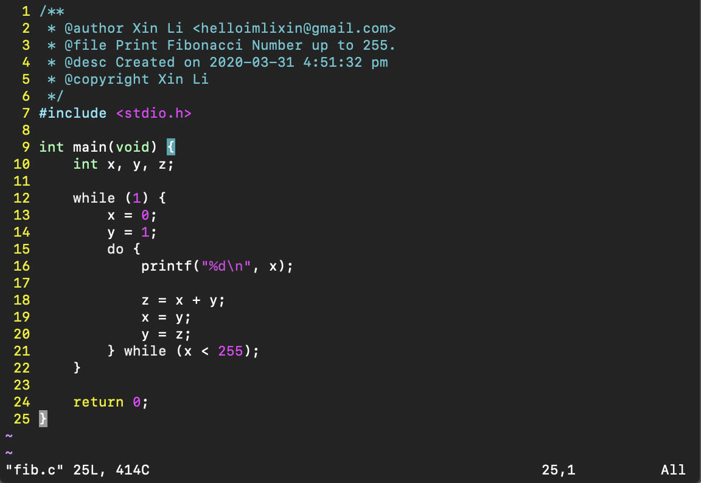
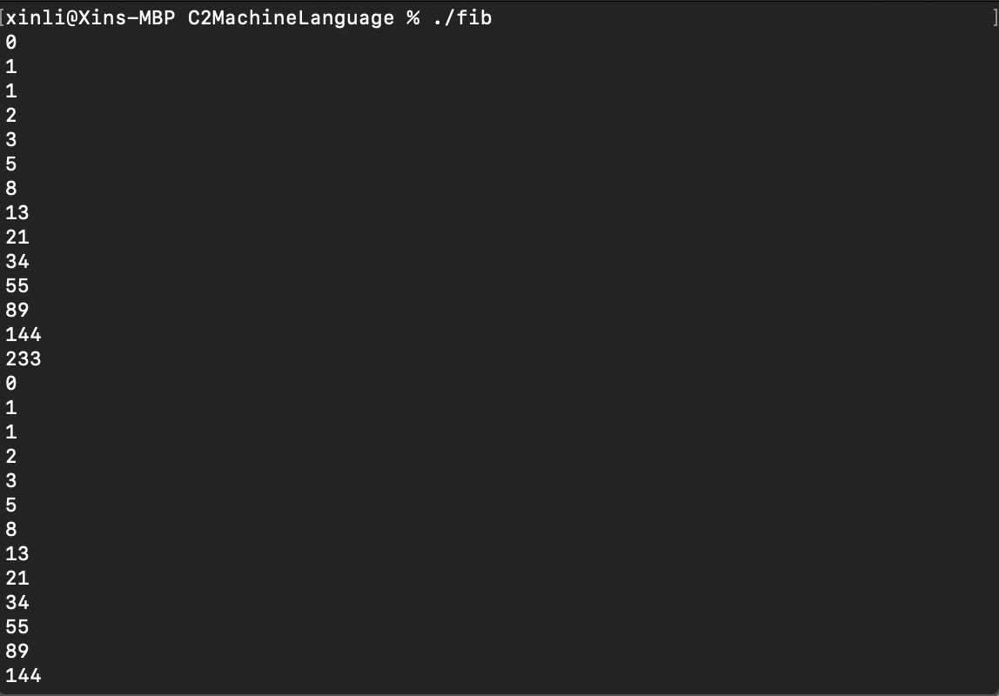
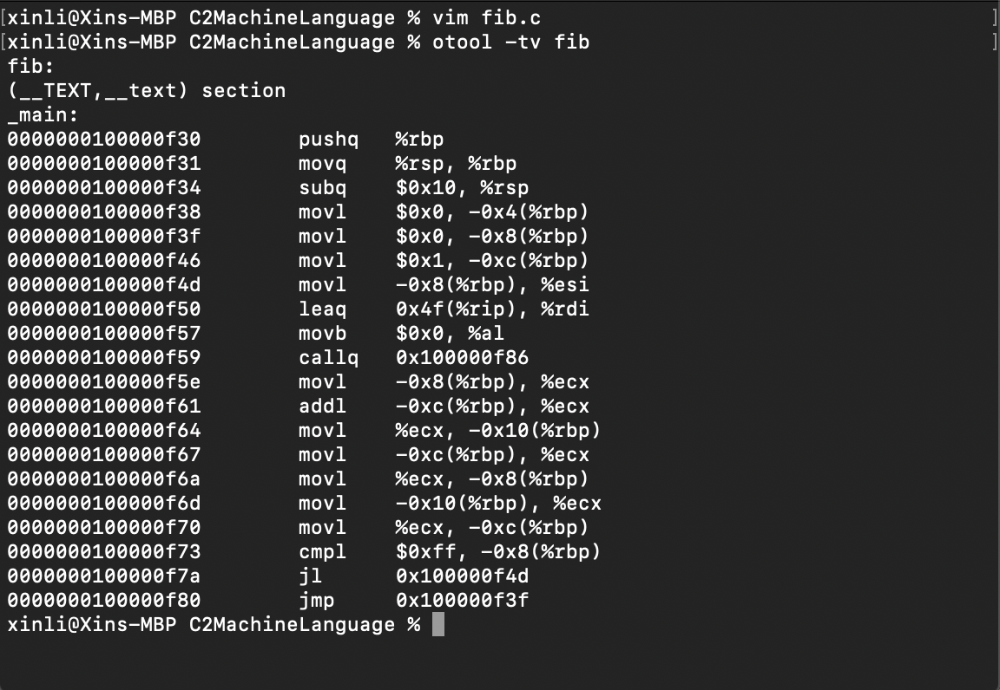
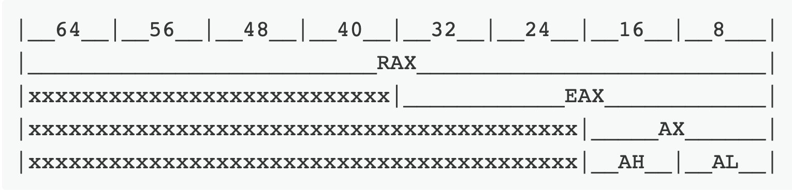

# Comparison Between C and Assembly Language

## An Example

Here let's look at an example in C that computes and prints out the Fibonacci Number up to 255 over and over again.



Here we compile it using the GNU C compiler `gcc` and name the output file as `fib`:

```bash
gcc fib.c -o fib
```

The terminal output would look like this:



Let's then take a look at the disassembly of `fib`:

```bash
otool -tv fib
```



Let's take a look at these lines in detail:

The first few lines are for the basic set up (stack frame) of the program, note here for ***registers***, we prefix them by `%` and for immediate values that are ***constants***, we prefix them by `$`:

```assembly
0000000100000f30    pushq    %rbp
0000000100000f31    movq    %rsp, %rbp
0000000100000f34    subq    $0x10, %rsp
0000000100000f38    movl    $0x0, -0x4(%rbp)
```

Here `%rbp` and `%rsp` are *special purpose registers*, `%rbp` is the stack base pointer, which points to the base of the current stack frame, and `%rsp` is the stack pointer, which points to the top of the current stack frame. `%rbp` always has a higher value than `%rsp` because the stack starts at a high memory address and grows downwards.

> Note: A Brief Review of Call Stack
> 
> A **call stack** is composed of *stack frames* where each stack frame corresponds to a call to a subroutine which has not yet terminated with a return. On x86_64, `%rbp` is the ***frame pointer*** to keep a snapshot of the ***stack pointer*** `%rsp` so that when adjustments are made to the stack pointer, the local variables and function parameters are still accessible from a constant offset of `%rbp`. Note that the decrement of the stack pointer can be different according to different stack frame sizes. At function return, the stack pointer is instead restored to the frame pointer, which is the essentially the value of the stack pointer just before the function was called. Each downward growing stack frame contains a stack pointer to the bottom of the frame immediately above. The stack pointer is a *mutable register* shared between all invocations. A frame pointer of a given invocation is a *copy* of the stack pointer as it was before the function was invoked.

Starting from the following lines we are going into our code:

```assembly
0000000100000f3f    movl    $0x0, -0x8(%rbp)
```

Where `movl` stands for ***move long***, which in here moves value 0 (here represented in hexadecimal) into `-0x8(%rbp)` which is actually an address offset, note that here `%rbp` is the stack base pointer (start of stack), and `-0x8` is just the ***offset*** in hexadecimal format denoting a specific location in memory. Hence the above line of assemly code corresponds to the following line in C:

```c
x = 0;
```

Where `-0x8` memory denotes `x`.

Similarly the next line:

```assembly
0000000100000f46    movl    $0x1, -0xc(%rbp)
```

corresponds to:

```c
y = 1
```

where `-0xc` memory location denotes variable `y`.

Now we are entering the `while-loop` in the C program, the following 4 lines correspond to the `printf` function defined in the C standard library `stdio.h`:

```assembly
0000000100000f4d    movl    -0x8(%rbp), %esi
0000000100000f50    leaq    0x4f(%rip), %rdi
0000000100000f57    movb    $0x0, %al
0000000100000f59    callq    0x100000f86
```

Corresponds to:

```c
printf("%d\n", x);
```

where `%esi` is a *non-volatile general-purpose register* that is often used as a *pointer*, `%rip` is the ***instruction pointer***, which points to the next instruction to execute, and `%rdi` is the ***register destination index*** (destination for data copies), `movb` stands for ***move bytes***. The last line `callq` calls function `printf` defined in `stdio.h` from location `0x100000f86`.

The following lines are the main steps for the Fibonacci number generation:

```assembly
0000000100000f5e    movl    -0x8(%rbp), %ecx
0000000100000f61    addl    -0xc(%rbp), %ecx
0000000100000f64    movl    %ecx, -0x10(%rbp)
```

Corresponds to:

```c
z = x + y;
```

First we move (`movl`) `x` (`-0x8(%rbp)`) to `%ecx`, which is a *volatile general-purpose register* that is occasionally used as a ***function parameter*** or as a ***loop counter***. Then we add (`addl`, add long) `y` (`-0xc(%rbp)`) to register `%ecx`  and store (`movl`) the result to a new register `-0x10(%rbp)`, which is `z` here.

> Note: x86 Family General Purpose Registers
> 
> One property of x86 family is that it maintains the **backwards compatibility** all the way back to 16-Bit 8086 processor. As x86 moved from 16-bit to 32-bit to 64-bit, the registers were expanded and given new names so as not to break the backwards compatibility with the code for older, narrower CPUs.
>
> For instance, the general purpose register `AX`, which is 16-bit, where the higher byte can be accessed with `AH` and the lower byte with `AL`. When the 32-bit 80386 came out, the Extended AX register, or EAX, is used to denote the 32-bit register, while `AX` continued to refer to a 16-bit register that made up the lower half of `EAX`. Similarly, when x86_64 came out, the `R` prefix was used. A simple illustration of this evolution is shown as follows:



Similarly, the following two lines:

```assembly
0000000100000f67    movl    -0xc(%rbp), %ecx
0000000100000f6a    movl    %ecx, -0x8(%rbp)
```

Corresponds to:

```c
x = y;
y = z;
```

Then we approach the `while-loop` part:

```assembly
0000000100000f73    cmpl    $0xff, -0x8(%rbp)
0000000100000f7a    jl    0x100000f4d
0000000100000f80    jmp    0x100000f3f
```

`compl` stands for ***compare long***, where we compare `x` (`-0x8(%rbp)`) with 255 (`$0xff`) and `jl` (jump if less than) to location `0x100000f4d` which is the following:

```assembly
0000000100000f4d    movl    -0x8(%rbp), %esi
```

along with the following two lines, corresponding to:

```c
printf("%d\n", x);
```

Then finally, `jmp` (jump) to `0x100000f3f`, which corresponds to:

```assembly
0000000100000f3f    movl    $0x0, -0x8(%rbp)
```

Which is:

```c
x = 0;
```
