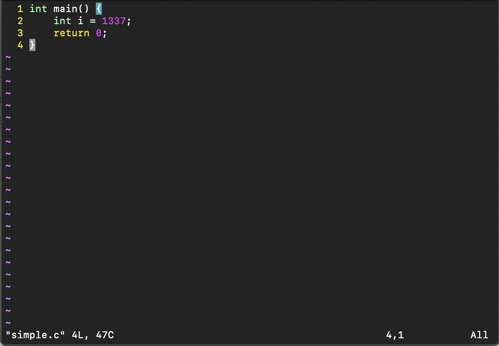
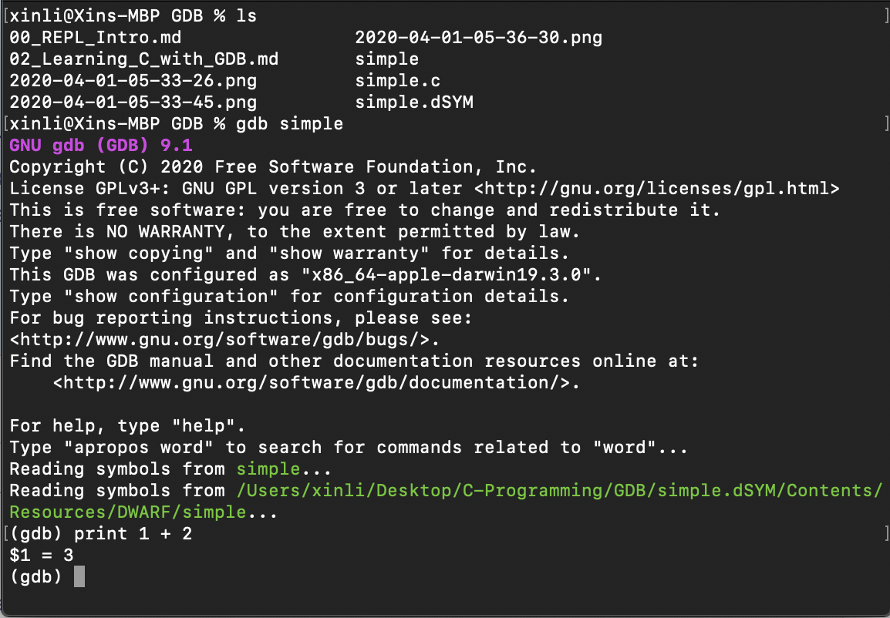
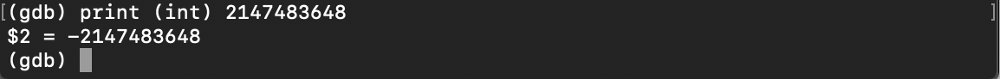

# Learning C with GDB

GDB could serve as a *pseudo-REPL* tool for C, in this tutorial, we will go through several basic GDB commands and a review of the differences between arrays and pointers in C.

## GDB Introduction

Let's start by a simple C program:

```c
int main() {
    int i = 1337;
    return 0;
}
```



Now we compile it with the `-g` flag so that GDB has debugging information to work with and then feed it to GDB:

```bash
gcc -g simple.c -o simple
gdb simple
```

We have the terminal output:


We can carry out simple arithmetic in C and print out the evaluation:



Note that even arithmetic can be tricky in C and GDB understands C arithmetic:



Now let's set a breakpoint in the `main` function and start the program:


